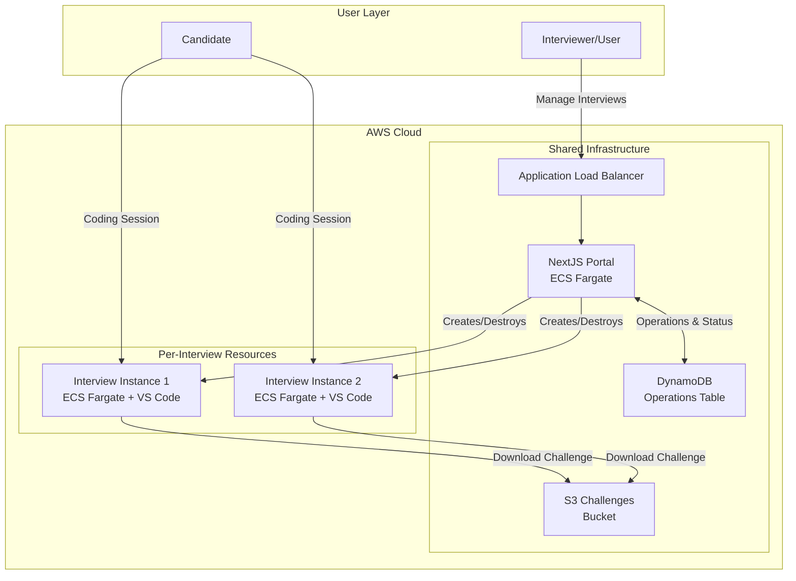
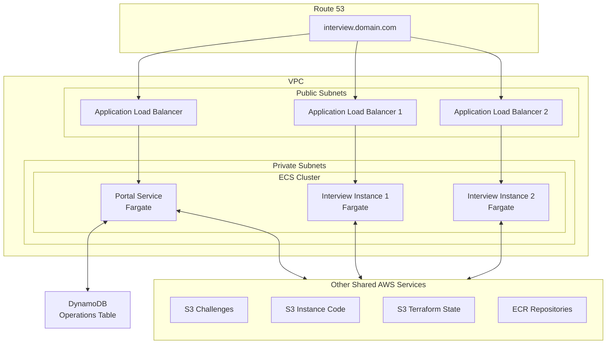
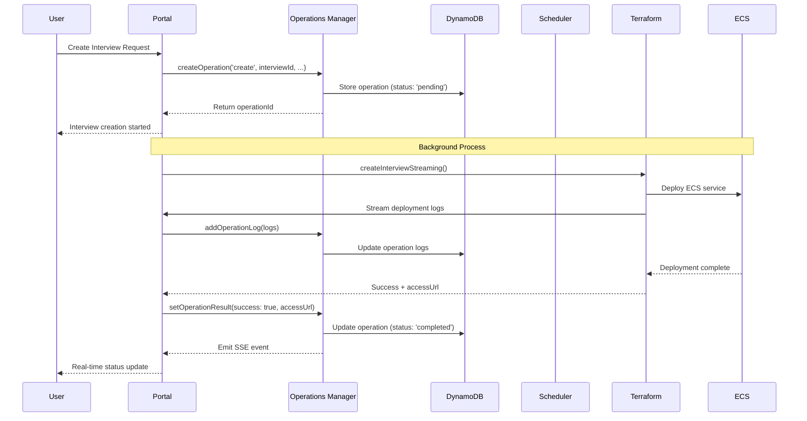
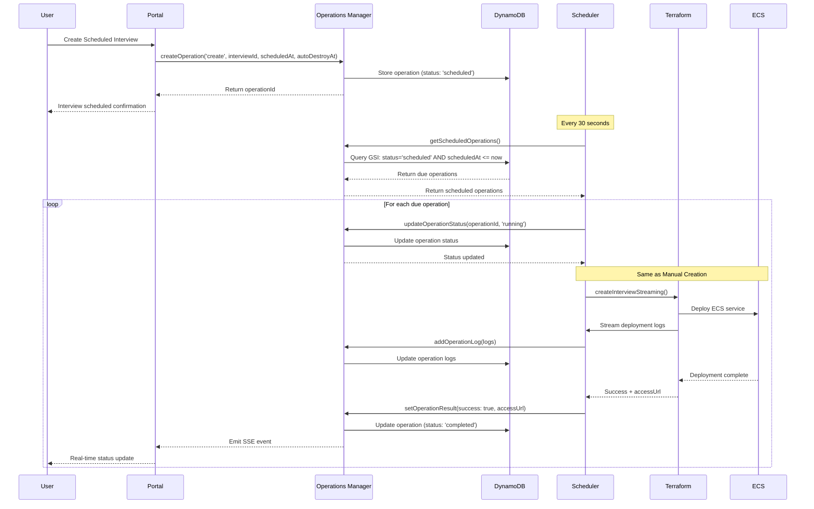
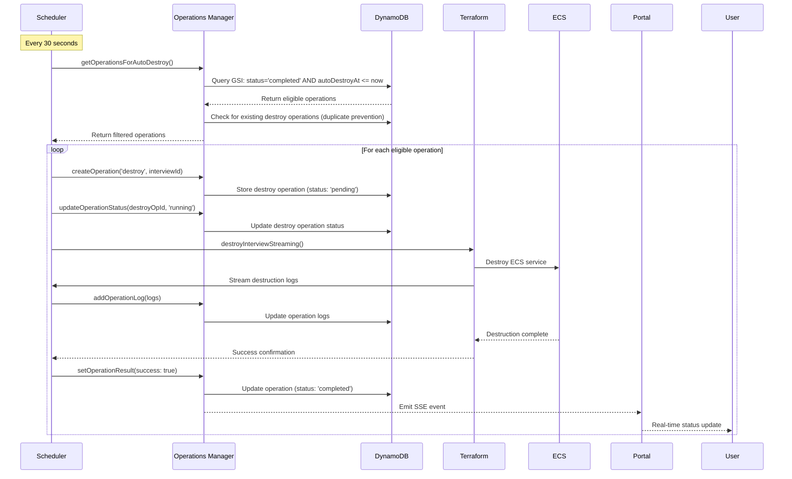
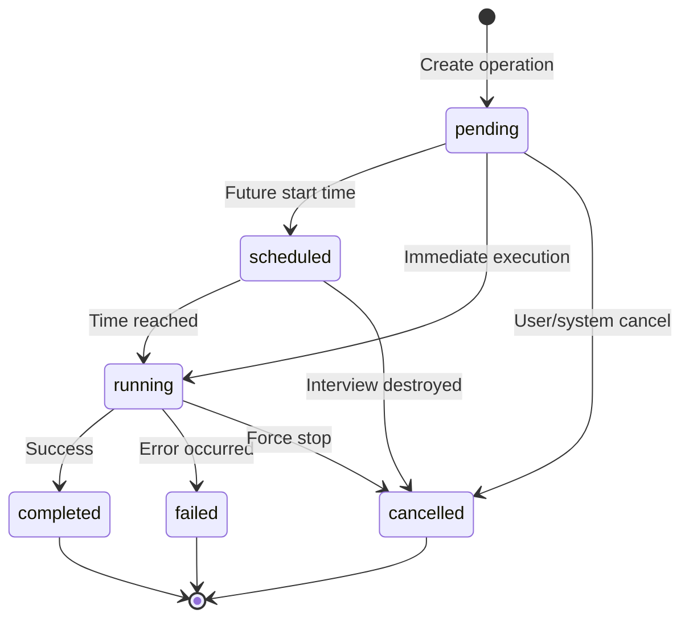
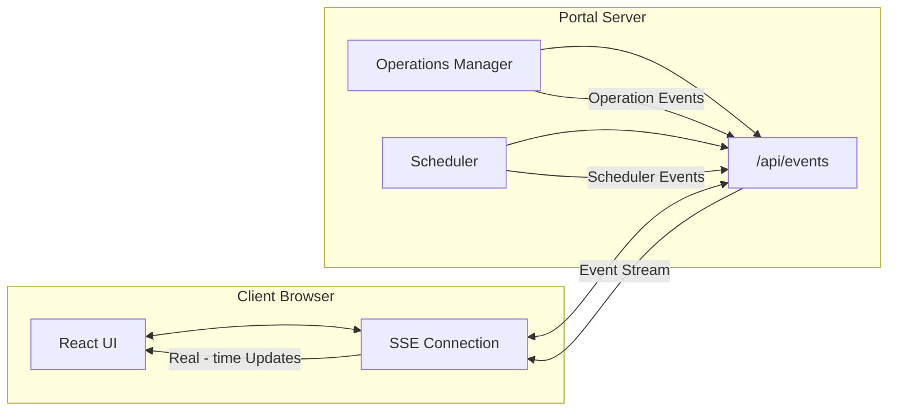
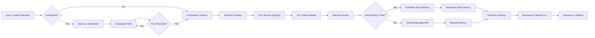

# Prequel Architecture

This document provides a comprehensive overview of the Prequel coding interview platform architecture, designed to help
new developers understand the system from high-level concepts to implementation details.

## Table of Contents

1. [High-Level Overview](#high-level-overview)
2. [Core Components](#core-components)
3. [AWS Infrastructure](#aws-infrastructure)
4. [Data Flow](#data-flow)
5. [Background Operations](#background-operations)
6. [Real-time Communication](#real-time-communication)
7. [Interview Lifecycle](#interview-lifecycle)
8. [Development Workflow](#development-workflow)

## High-Level Overview

Prequel is a cloud-native platform that provisions on-demand VS Code instances for coding interviews. The system is
built on AWS using a microservices architecture with persistent operation tracking and real-time updates.



### Key Principles

- **On-Demand Provisioning**: Interview environments are created when needed and destroyed after use
- **Isolation**: Each interview gets its own containerized VS Code instance
- **Persistence**: Operations survive container restarts using DynamoDB
- **Real-time**: Live status updates via Server-Sent Events (SSE)
- **Auto-cleanup**: Mandatory resource cleanup prevents forgotten instances

## Core Components

### 1. Centralized Configuration System (`portal/src/lib/config.ts`)

**Purpose**: Type-safe, centralized management of all environment variables and AWS resource configuration.

**Key Features**:

- **Automatic AWS Resource Naming**: Generates consistent names for DynamoDB tables, S3 buckets, and ECS clusters
- **Context-Aware Authentication**: Automatically detects local vs ECS deployment and uses appropriate credentials
- **Type Safety**: Provides TypeScript interfaces for all configuration values
- **Validation**: Validates environment consistency and provides clear error messages
- **Runtime Detection**: Distinguishes between browser/server and development/production contexts

**Configuration Categories**:

```typescript
const config = {
  aws: {
    region: string,                    // AWS region
    profile: string,                   // SSO profile for local development
    getCredentials(): CredentialsConfig,    // Context-aware credential provider
    deploymentContext: 'ecs' | 'local'      // Auto-detected deployment context
  },
  project: {
    prefix: string,                    // Project prefix for resource naming
    environment: string,               // Environment (dev/staging/prod)
    domainName: string                 // Domain for interview URLs
  },
  database: {
    interviewsTable: string,           // Auto-generated: {prefix}-{env}-interviews
    operationsTable: string            // Auto-generated: {prefix}-{env}-operations
  },
  storage: {
    challengeBucket: string,           // Auto-generated: {prefix}-challenge
    historyBucket: string,             // Auto-generated: {prefix}-{env}-history
    terraformStateBucket: string,      // Auto-generated: {prefix}-{env}-terraform-state
    instanceBucket: string             // Auto-generated: {prefix}-instance
  },
  infrastructure: {
    ecsCluster: string                 // Auto-generated: {prefix}-{env}
  }
}
```

**AWS Authentication Strategy**:

- **Local Development**: Uses `AWS_PROFILE` with SSO credentials via `fromSSO()`
- **ECS Deployment**: Uses IAM task roles automatically (no configuration needed)
- **Auto-Detection**: Detects context via `AWS_EXECUTION_ENV` environment variable

### 2. NextJS Portal (`portal/`)

**Purpose**: Web-based management interface for creating, monitoring, and managing coding interviews.

**Key Features**:

- Interview creation with challenge selection
- Real-time status monitoring via SSE
- Operation logs and progress tracking
- Scheduled interviews with auto-destroy timers
- Authentication and access control

### 2. Operations Manager (`src/lib/operations.ts`)

**Purpose**: DynamoDB-backed system for tracking all background operations (interview creation/destruction).

**Key Features**:

- Persistent operation storage across container restarts
- Efficient querying using DynamoDB Global Secondary Indexes (GSI)
- Real-time event emission for SSE clients
- Automatic cleanup via TTL (24 hours)
- Atomic status updates and batched logging
- Graceful throttling handling during auto-scaling
- On-demand billing with automatic capacity scaling

**DynamoDB Schema**:

```typescript
interface Operation {
    id: string                    // Primary Key
    type: 'create' | 'destroy'
    status: 'pending' | 'running' | 'completed' | 'failed' | 'cancelled' | 'scheduled'
    interviewId: string          // GSI: interviewId-type-index
    candidateName?: string
    challenge?: string
    createdAt: Date
    scheduledAt?: Date           // GSI: status-scheduledAt-index
    autoDestroyAt?: Date         // GSI: status-autoDestroyAt-index
    logs: string[]
    result?: OperationResult
}
```

### 3. Scheduler Service (`src/lib/scheduler.ts`)

**Purpose**: Background service that processes scheduled operations and auto-destroy timeouts.

**Key Features**:

- 30-second polling interval for due operations
- Efficient DynamoDB GSI queries for scheduled operations
- Auto-destroy timeout processing with duplicate prevention
- Event emission for real-time scheduler status
- Robust error handling and retry logic

### 4. Interview Instances (`instance/`)

**Purpose**: Isolated containerized VS Code environments for each coding interview.

**Key Features**:

- VS Code Server with pre-configured extensions
- Challenge files automatically copied from S3
- Isolated network environment per interview
- Health checks for service availability
- Automatic cleanup after interview completion

### 5. Terraform Infrastructure (`infra/`)

**Purpose**: Infrastructure as Code for provisioning and managing AWS resources.

**Components**:

- Shared infrastructure (VPC, ECS Cluster, ALB, DynamoDB)
- Per-interview resources (ECS services, target groups)
- S3 buckets for challenges and Terraform state
- IAM roles and security groups

## AWS Infrastructure



### DynamoDB Table Design

**Table Name**: `{PROJECT_PREFIX}-{ENVIRONMENT}-operations`

**Primary Key**: `id` (String)

**Global Secondary Indexes**:

1. **status-scheduledAt-index**: Query operations by status and scheduled time
2. **status-autoDestroyAt-index**: Query operations eligible for auto-destroy
3. **interviewId-type-index**: Query operations by interview and type (prevents duplicates)

**TTL**: Automatic cleanup after 24 hours using `ttl` attribute

**Performance Optimizations**:

- **PAY_PER_REQUEST Billing**: Automatic capacity scaling based on demand
- **Log Batching**: Multiple log entries batched together to reduce writes
- **Throttling Handling**: Graceful degradation during DynamoDB auto-scaling
- **Efficient Queries**: GSI-based queries for O(1) lookups instead of scans

## Data Flow

### Manual Interview Creation Flow



1. Immediate Response (< 1 second):
    - Portal creates operation record in DynamoDB (status: 'pending')
    - Returns operationId to user
    - User sees "Interview creation started" message
2. Background Process (2-5 minutes):
    - Portal calls terraformManager.createInterviewStreaming()
    - Terraform provisions AWS resources:
    - ECS service definition
    - Application Load Balancer target group
    - Security groups
    - Task definition
        - ECS starts the container with VS Code Server
        - Challenge files are copied from S3 to the container
        - Health checks verify VS Code is accessible
        - Operation status updated to completed with access URL
3. Real-time Updates:
    - Each step logs to DynamoDB (batched every 2 seconds)
    - SSE events sent to browser for live status updates
    - User sees progress in real-time without refreshing

### Scheduled Interview Creation Flow



**Key Differences from Manual Creation:**

1. **Initial Storage**: Operation stored with `status: 'scheduled'` instead of `status: 'pending'`
2. **Scheduler Involvement**: Scheduler polls every 30 seconds to check for due operations
3. **Time-based Trigger**: Execution only starts when `scheduledAt` time is reached
4. **Same Execution**: Once triggered, follows identical deployment process as manual creation
5. **Auto-destroy Setup**: `autoDestroyAt` timer automatically set based on interview duration

**Scheduler Query Process:**

- Uses `status-scheduledAt-index` GSI for efficient querying
- Only processes operations where `scheduledAt <= now`
- Prevents duplicate execution through status checks

### Auto-Destroy Flow



**Auto-Destroy Process:**

1. **Eligibility Check** (Every 30 seconds):
    - Scheduler queries for completed create operations past their `autoDestroyAt` time
    - Uses `status-autoDestroyAt-index` GSI for efficient querying
    - Filters for `type: 'create'` operations with `result.success: true`

2. **Duplicate Prevention**:
    - Checks `interviewId-type-index` GSI for existing destroy operations
    - Prevents multiple destroy operations for the same interview
    - Only processes interviews without existing destroy operations

3. **Destroy Operation Creation**:
    - Creates new operation with `type: 'destroy'` and `status: 'pending'`
    - Links to original interview via `interviewId`
    - Inherits candidate name and challenge from original operation

4. **Resource Cleanup**:
    - Terraform destroys all AWS resources (ECS service, target groups, security groups)
    - Streams destruction logs to DynamoDB (batched every 2 seconds)
    - Removes Terraform workspace files from S3
    - Updates operation status to `completed` on success

**Key Features:**

- **Automatic**: No manual intervention required
- **Reliable**: Duplicate prevention ensures single cleanup per interview
- **Observable**: Real-time logs and SSE events for monitoring
- **Efficient**: GSI queries prevent full table scans
- **Mandatory**: All interviews must have auto-destroy times set

## Background Operations

The operations system is the backbone of the platform, providing reliable tracking of all long-running tasks.

### Operation States



### Key Design Patterns

1. **Event-Driven Architecture**: Operations emit events for real-time UI updates
2. **Idempotency**: Duplicate operations are prevented through GSI queries
3. **Persistence**: All state survives container restarts via DynamoDB
4. **Observability**: Detailed logging for debugging and monitoring
5. **Graceful Degradation**: System continues working if non-critical operations fail
6. **Batch Processing**: Log entries are batched to reduce DynamoDB write volume
7. **Throttling Resilience**: Graceful handling of DynamoDB auto-scaling throttling

## Real-time Communication

### Server-Sent Events (SSE) Architecture



### Event Types

| Event Type         | Source             | Purpose                             |
|--------------------|--------------------|-------------------------------------|
| `connection`       | SSE Endpoint       | Connection acknowledgment           |
| `heartbeat`        | SSE Endpoint       | Keep-alive (every 30s)              |
| `operation_status` | SSE Endpoint       | Periodic active operation summary   |
| `operation_update` | Operations Manager | Immediate operation state changes   |
| `scheduler_event`  | Scheduler Service  | Background processing notifications |

## Interview Lifecycle

### Complete Interview Flow



### Resource Lifecycle

1. **Creation Phase**:
    - Operation created in DynamoDB
    - Terraform workspace prepared
    - ECS service deployed
    - Health checks verify availability

2. **Active Phase**:
    - Candidate accesses VS Code
    - Challenge files available
    - Real-time monitoring active

3. **Cleanup Phase**:
    - Auto-destroy timer triggers
    - Terraform destroys resources
    - Operation marked complete
    - Workspace files cleaned up
