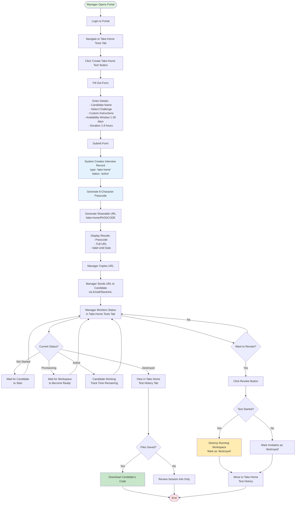
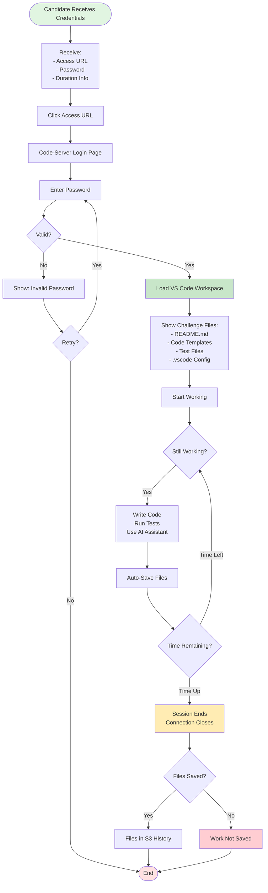
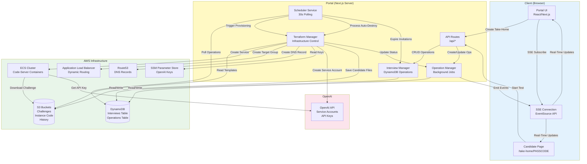
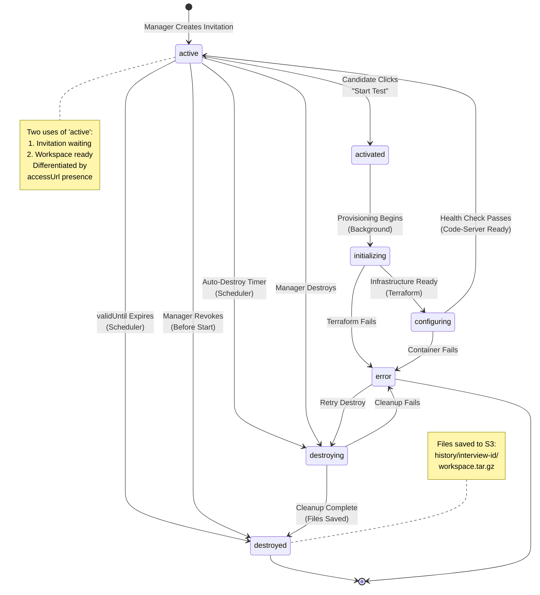

# User Flow Documentation

This document describes the complete user flows for the Prequel coding interview platform, including both regular interviews and take-home tests.

## Table of Contents

1. [Take-Home Test Flow](#take-home-test-flow)
2. [Regular Interview Flow](#regular-interview-flow)
3. [System Architecture](#system-architecture)

---

## Take-Home Test Flow

Take-home tests allow managers to send coding challenges to candidates that can be completed asynchronously within a specified time window.

### Manager: Creating a Take-Home Test

### Candidate: Taking a Take-Home Test

```mermaid
flowchart TD
    Start([Candidate Receives URL]) --> ClickURL[Click URL Link<br/>/take-home/PASSCODE]
    ClickURL --> LoadPage[Page Loads Take-Home Details]

    LoadPage --> LookupPasscode[System Looks Up Interview<br/>by Passcode]
    LookupPasscode --> ValidatePasscode{Valid Passcode?}

    ValidatePasscode -->|No| ErrorNotFound[Show Error:<br/>'Take-home test not found']
    ValidatePasscode -->|Yes| CheckStatus{Interview Status?}

    CheckStatus -->|error| ErrorFailed[Show Error:<br/>'Provisioning Failed'<br/>Contact Interviewer]
    CheckStatus -->|destroyed/completed| ShowCompleted[Show: Test Already Completed]
    CheckStatus -->|active no URL| CheckExpiry{Expired?}
    CheckStatus -->|active with URL| ShowWorkspace[Show Workspace Details<br/>URL + Password]
    CheckStatus -->|provisioning| ShowProgress[Show Provisioning Progress<br/>Spinner + Status Updates]

    CheckExpiry -->|Yes| ErrorExpired[Show Error:<br/>'Invitation Expired']
    CheckExpiry -->|No| ShowInstructions[Show Instructions Page]

    ShowInstructions --> DisplayInfo[Display:<br/>- Platform Instructions<br/>- Custom Challenge Instructions<br/>- Duration Info<br/>- Auto-Destroy Warning]
    DisplayInfo --> StartBtn[Show 'Start Test' Button]

    StartBtn --> ClickStart[Candidate Clicks 'Start Test']
    ClickStart --> RateLimit{Rate Limit Check}

    RateLimit -->|Exceeded| ErrorRateLimit[Show Error:<br/>'Too Many Attempts']
    RateLimit -->|OK| Activate[Update Status to 'activated'<br/>Set activatedAt timestamp]

    Activate --> CalcDestroy[Calculate autoDestroyAt<br/>= now + durationMinutes]
    CalcDestroy --> CreateOp[Create Background Operation<br/>type: 'create']
    CreateOp --> StartProvisioning[Start Infrastructure Provisioning]

    StartProvisioning --> UpdateStatus1[Update to 'initializing'<br/>Terraform Provisioning]
    UpdateStatus1 --> SSEUpdate1[SSE Event: Status Update]
    SSEUpdate1 --> PageRefresh1[Page Auto-Refreshes via SSE]
    PageRefresh1 --> ShowProgress

    ShowProgress --> Provision[Provision AWS Resources:<br/>- ECS Service<br/>- ALB Target Group<br/>- Security Groups<br/>- Route53 DNS<br/>- OpenAI Service Account]

    Provision --> UpdateStatus2[Update to 'configuring'<br/>ECS Container Starting]
    UpdateStatus2 --> SSEUpdate2[SSE Event: Status Update]
    SSEUpdate2 --> PageRefresh2[Page Auto-Refreshes via SSE]
    PageRefresh2 --> ShowProgress

    ShowProgress --> Container[Configure Container:<br/>- Copy Challenge Files from S3<br/>- Start Code-Server<br/>- Run Health Checks]

    Container --> UpdateStatus3[Update to 'active'<br/>Set accessUrl + password]
    UpdateStatus3 --> SSEUpdate3[SSE Event: Status Update]
    SSEUpdate3 --> PageRefresh3[Page Auto-Refreshes via SSE]
    PageRefresh3 --> ShowWorkspace

    ShowWorkspace --> DisplayWorkspace[Display:<br/>- Access URL clickable link<br/>- Password with copy button<br/>- Time Remaining Countdown<br/>- Challenge Instructions]

    DisplayWorkspace --> OpenWorkspace[Candidate Opens URL<br/>in New Tab]
    OpenWorkspace --> EnterPassword[Enter Password in Code-Server]
    EnterPassword --> StartCoding[Start Coding in VS Code]

    StartCoding --> WorkLoop{Still Working?}
    WorkLoop -->|Yes| ContinueCoding[Write Code<br/>Run Tests<br/>Debug]
    ContinueCoding --> CheckTime{Time Remaining?}

    CheckTime -->|Time Left| WorkLoop
    CheckTime -->|Time Up| AutoDestroy[System Auto-Destroys Workspace]

    AutoDestroy --> SaveFiles[Extract and Save Files to S3<br/>history/interview-id/...]
    SaveFiles --> UpdateDestroyed[Update Status to 'destroyed'<br/>Set destroyedAt timestamp]
    UpdateDestroyed --> SSEUpdate4[SSE Event: Status Update]
    SSEUpdate4 --> PageRefresh4[Page Auto-Refreshes via SSE]
    PageRefresh4 --> ShowCompleted

    ShowCompleted --> DisplayCompleted[Show:<br/>'Test Completed'<br/>'Work has been saved']

    WorkLoop -->|Finished Early| ManualExit[Close Browser Tab]
    ManualExit --> WaitDestroy[Wait for Auto-Destroy Timer]
    WaitDestroy --> AutoDestroy

    DisplayCompleted --> End([End])
    ErrorNotFound --> End
    ErrorFailed --> End
    ErrorExpired --> End
    ErrorRateLimit --> End

    style Start fill:#e1f5e1
    style End fill:#ffe1e1
    style Activate fill:#e3f2fd
    style StartProvisioning fill:#fff9c4
    style AutoDestroy fill:#ffecb3
    style SaveFiles fill:#c8e6c9
    style ShowWorkspace fill:#c8e6c9
    style ErrorNotFound fill:#ffcdd2
    style ErrorFailed fill:#ffcdd2
    style ErrorExpired fill:#ffcdd2
```

### Take-Home Test States

| State | Status | Description | Visible To |
|-------|--------|-------------|------------|
| **Invitation Created** | `active` | Passcode generated, URL sent to candidate, not yet started | Manager (Active Tab) |
| **Expired Invitation** | `destroyed` | validUntil passed before candidate started | Manager (History Tab) |
| **Activation Started** | `activated` | Candidate clicked "Start Test", provisioning beginning | Manager (Active Tab) |
| **Provisioning Infrastructure** | `initializing` | Terraform creating AWS resources (ECS, ALB, etc.) | Manager (Active Tab), Candidate (Progress) |
| **Configuring Workspace** | `configuring` | Container starting, files copying, code-server launching | Manager (Active Tab), Candidate (Progress) |
| **Workspace Ready** | `active` + accessUrl | Code-server running, candidate can access workspace | Manager (Active Tab), Candidate (Access Details) |
| **Provisioning Failed** | `error` | Infrastructure creation failed | Manager (Active Tab), Candidate (Error) |
| **Auto-Destroyed** | `destroyed` | Duration expired, workspace cleaned up, files saved | Manager (History Tab), Candidate (Completed) |
| **Manually Revoked** | `destroyed` | Manager revoked before/during test | Manager (History Tab), Candidate (Completed) |

---

## Regular Interview Flow

Regular interviews are synchronous, scheduled sessions where the manager creates and monitors the interview in real-time.

### Manager: Creating a Regular Interview

```mermaid
flowchart TD
    Start([Manager Opens Portal]) --> Login[Login to Portal]
    Login --> Dashboard[Navigate to Current Interviews Tab]
    Dashboard --> CreateBtn[Click 'Create Interview' Button]
    CreateBtn --> FormType{Scheduled or<br/>Immediate?}

    FormType -->|Immediate| FillImmediate[Fill Form:<br/>- Candidate Name<br/>- Select Challenge<br/>- Duration 30min-4hr]
    FormType -->|Scheduled| FillScheduled[Fill Form:<br/>- Candidate Name<br/>- Select Challenge<br/>- Scheduled Time<br/>- Duration 30min-4hr]

    FillImmediate --> Submit[Submit Form]
    FillScheduled --> Submit

    Submit --> CreateOp[Create Background Operation]
    CreateOp --> CheckSchedule{Scheduled?}

    CheckSchedule -->|No| StartNow[Start Provisioning Immediately]
    CheckSchedule -->|Yes| ScheduleOp[Schedule Operation<br/>Start 5 min before scheduled time]

    ScheduleOp --> ShowScheduled[Display as 'Scheduled'<br/>Show Scheduled Time<br/>Show Auto-Destroy Time]
    ShowScheduled --> WaitSchedule[Wait for Scheduled Time]
    WaitSchedule --> PreProvision[Pre-Provisioning Starts<br/>5 Minutes Early]
    PreProvisionStartNow --> Provision[Provision Infrastructure]

    StartNow --> Provision
    Provision --> Status1[Status: 'initializing']
    Status1 --> SSE1[SSE Event Sent]
    SSE1 --> Configure[Configure Container]
    Configure --> Status2[Status: 'configuring']
    Status2 --> SSE2[SSE Event Sent]
    SSE2 --> HealthCheck[Health Check Passed]
    HealthCheck --> Status3[Status: 'active']
    Status3 --> SSE3[SSE Event Sent]

    SSE3 --> DisplayReady[Display:<br/>- Access URL<br/>- Password<br/>- Time Remaining]
    DisplayReady --> ShareCreds[Manager Shares Credentials<br/>with Candidate]

    ShareCreds --> Monitor[Monitor Interview Progress]
    Monitor --> CheckTimer{Auto-Destroy<br/>Timer?}

    CheckTimer -->|Time Up| AutoDestroy[Auto-Destroy Workspace]
    CheckTimer -->|Manual| ManualDestroy[Manager Clicks Destroy]

    AutoDestroy --> Cleanup[Cleanup AWS Resources<br/>Optional: Save Files]
    ManualDestroy --> Cleanup

    Cleanup --> UpdateDestroyed[Status: 'destroyed']
    UpdateDestroyed --> MoveHistory[Move to Interview History]
    MoveHistory --> End([End])

    style Start fill:#e1f5e1
    style End fill:#ffe1e1
    style Provision fill:#fff9c4
    style AutoDestroy fill:#ffecb3
    style DisplayReady fill:#c8e6c9
```

### Candidate: Joining a Regular Interview

---

## System Architecture

### Data Flow Architecture

### State Machine: Take-Home Test Lifecycle

### Database Schema

#### Interviews Table (DynamoDB)

| Attribute | Type | Description | Indexed |
|-----------|------|-------------|---------|
| `id` | String (PK) | Unique interview ID | Primary Key |
| `type` | String | `'regular'` or `'take-home'` | - |
| `candidateName` | String | Candidate's name | GSI: candidateName-createdAt-index |
| `challenge` | String | Challenge identifier | - |
| `status` | String | Current state (see states above) | GSI: status-createdAt-index |
| `passcode` | String | 8-char code (take-home only) | GSI: PasscodeIndex |
| `validUntil` | Number | Unix timestamp (take-home only) | - |
| `customInstructions` | String | Manager's instructions (take-home) | - |
| `durationMinutes` | Number | Test duration (take-home) | - |
| `activatedAt` | Number | Unix timestamp when started | - |
| `createdAt` | Number | Unix timestamp when created | Sort Key (GSI) |
| `autoDestroyAt` | Number | Unix timestamp for auto-cleanup | - |
| `accessUrl` | String | Workspace URL | - |
| `password` | String | Workspace password | - |
| `destroyedAt` | Number | Unix timestamp when destroyed | - |
| `historyS3Key` | String | S3 path to saved files | - |
| `ttl` | Number | Unix timestamp for DynamoDB TTL | - |

#### Operations Table (DynamoDB)

| Attribute | Type | Description | Indexed |
|-----------|------|-------------|---------|
| `id` | String (PK) | Unique operation ID | Primary Key |
| `type` | String | `'create'` or `'destroy'` | - |
| `interviewId` | String | Related interview ID | GSI: interviewId-createdAt-index |
| `status` | String | `'pending'`, `'running'`, `'completed'`, `'failed'`, `'scheduled'`, `'cancelled'` | GSI: status-createdAt-index |
| `scheduledAt` | Number | Unix timestamp to start | GSI: scheduledAt-index |
| `autoDestroyAt` | Number | Unix timestamp to destroy | GSI: autoDestroyAt-index |
| `candidateName` | String | Candidate's name | - |
| `challenge` | String | Challenge identifier | - |
| `createdAt` | Number | Unix timestamp when created | Sort Key (GSI) |
| `completedAt` | Number | Unix timestamp when finished | - |
| `result` | Map | Operation result details | - |
| `logs` | List | Array of log messages | - |
| `ttl` | Number | Unix timestamp for DynamoDB TTL | - |

---

## Key Features

### Real-Time Updates (SSE)

- **Technology**: Server-Sent Events (EventSource API)
- **Endpoint**: `/api/events`
- **Update Frequency**: Immediate on status changes, 30s heartbeat
- **Events**:
  - `connection`: Initial connection
  - `heartbeat`: Keep-alive ping
  - `operation_status`: Bulk status every 5s
  - `operation_update`: Immediate on change
  - `scheduler_event`: Scheduler actions

### Background Operations

- **Non-blocking**: All provisioning/destruction happens in background
- **Persistent**: Stored in DynamoDB, survives server restarts
- **Logged**: Detailed logs for debugging
- **TTL**: Auto-cleanup after 7 days

### Scheduler Service

- **Polling Interval**: 30 seconds
- **Responsibilities**:
  - Process scheduled operations (5min pre-provisioning)
  - Trigger auto-destroy timeouts
  - Mark expired take-home invitations
- **Efficiency**: Uses DynamoDB GSI for fast queries

### Security Features

- **Rate Limiting**: 3 activation attempts per IP per hour (take-home)
- **Passcode Validation**: 8-character unique codes
- **Expiration**: validUntil enforced
- **One-Time Activation**: Cannot restart after activation
- **Auto-Destroy**: Mandatory for all interviews

### File Management

- **Challenge Files**: Stored in S3, synced to container on start
- **Candidate Files**: Optionally extracted and saved to S3 on destroy
- **History Access**: Download via portal interface
- **Format**: Compressed tar.gz archives

---

## Error Handling

### Take-Home Test Errors

| Error | Trigger | User Impact | Recovery |
|-------|---------|-------------|----------|
| Invalid Passcode | Wrong/missing passcode | Cannot access page | Check URL, contact manager |
| Expired Invitation | Past validUntil date | Cannot start test | Contact manager for new invite |
| Rate Limit Exceeded | Too many start attempts | Cannot start test | Wait 1 hour or contact manager |
| Provisioning Failed | Infrastructure error | See error message | Contact manager, they can retry |
| Already Started | Status not 'active' | Cannot restart | Continue or contact manager |
| Workspace Lost | Container crash | Lost connection | Contact manager immediately |

### Manager Actions on Errors

1. **Provisioning Fails**: Check operation logs, retry by creating new test
2. **Candidate Can't Access**: Verify passcode/URL, check expiration, check status
3. **Files Not Saved**: Cannot recover, inform candidate early
4. **Workspace Crashed**: Candidate loses work, consider extending time via new invite

---

## Best Practices

### For Managers

1. **Test Duration**: Add buffer time (recommend 30-60min extra)
2. **Clear Instructions**: Include all necessary context in custom instructions
3. **Communicate Early**: Send invite well before needed
4. **Monitor Status**: Check portal periodically during active tests
5. **Save Files**: Always enable file saving for later review

### For Candidates

1. **Start Early**: Begin as soon as ready, provisioning takes 3-5 minutes
2. **Save Frequently**: Code auto-saves, but manually save important milestones
3. **Watch Timer**: Countdown displayed prominently
4. **No Reloads**: Page refreshes automatically via SSE, don't manually reload
5. **Report Issues**: Contact interviewer immediately if problems occur

---

## Monitoring and Observability

### Portal Logs

- **Scheduler**: Logs every 30s cycle, operation processing
- **Terraform**: Detailed provisioning/destruction logs
- **Operations**: All status changes logged
- **SSE**: Connection events, client counts

### AWS CloudWatch

- **ECS Tasks**: Container logs, health checks
- **ALB**: Request logs, target health
- **Route53**: DNS query logs

### DynamoDB

- **Metrics**: Read/write capacity, throttling
- **TTL**: Automatic cleanup monitoring
- **GSI**: Index query performance

---

## Future Enhancements

- [ ] Email notifications on status changes
- [ ] Slack integration for real-time alerts
- [ ] Code quality analysis post-submission
- [ ] Video recording of coding session
- [ ] Multi-file download (not just workspace.tar.gz)
- [ ] Candidate feedback form
- [ ] Analytics dashboard for hiring metrics
